<div align="center">

# 🏁 GT7 Schermo e LED

**Cruscotto da 320×240 e striscia LED shift light per Gran Turismo 7 e Assetto Corsa**<br>
Due ESP32 che leggono la telemetria del gioco in Wi-Fi, senza PC.


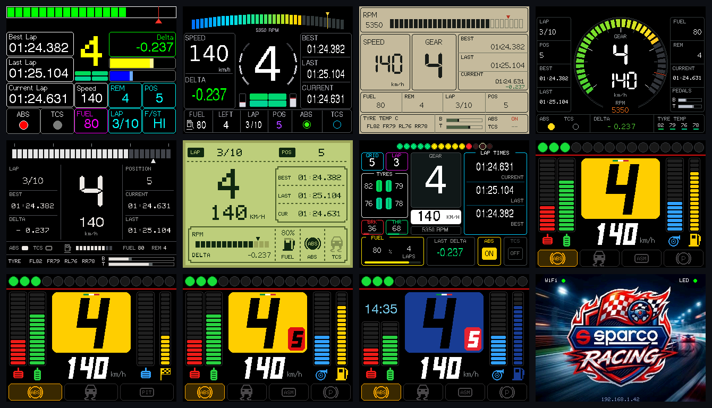

<sub>Tutte le immagini sono generate dal vero codice grafico del firmware: sono pixel per pixel quello che compare sullo schermo.</sub>

</div>

---

## Indice

- [Come funziona](#come-funziona)
- [Hardware](#hardware)
- [Funzioni](#funzioni)
- [Temi del cruscotto (11)](#temi-del-cruscotto-11)
- [Schermata di attesa](#schermata-di-attesa)
- [Menu e impostazioni](#menu-e-impostazioni)
- [Striscia LED](#striscia-led)
- [Comunicazione tra schermo e LED](#comunicazione-tra-schermo-e-led)
- [Compilare e caricare i firmware](#compilare-e-caricare-i-firmware)
- [Struttura del repository](#struttura-del-repository)
- [Rigenerare gli screenshot](#rigenerare-gli-screenshot)
- [Crediti e licenze](#crediti-e-licenze)

---

## Come funziona

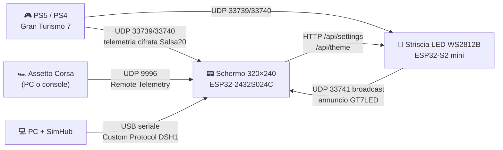

- Lo **schermo** e la **striscia LED** si collegano alla stessa rete Wi-Fi della console e ricevono la telemetria di GT7 direttamente, ognuno per conto suo.
- La striscia si annuncia in rete ogni 2 secondi. Lo schermo la trova da solo e diventa il suo **telecomando**: tema, luminosità, colore e animazione di riposo si cambiano dal touch, senza aprire la pagina web.
- In alternativa a GT7 lo schermo legge **Assetto Corsa** in Wi-Fi, oppure qualsiasi gioco PC tramite **SimHub** via USB.

## Hardware

| Componente | Modello | Note |
| --- | --- | --- |
| Schermo | **ESP32-2432S024C** (2.4″ ILI9341, touch capacitivo CST820) | scheda in uso, ambiente `esp32-2432s024c` |
| Schermo, alternativa | ESP32-2432S028 (2.8″ ILI9341 o ST7789, touch resistivo) | ambienti `esp32` e `esp32-st7789` |
| Controller LED | **LOLIN / Wemos ESP32-S2 mini** | dati LED sul **GPIO 7** |
| LED | Striscia **WS2812B** (fino a 200 LED, 143 di default) | alimentazione 5 V, limite corrente regolabile |

## Funzioni

**Schermo**

- 🚗 Telemetria **GT7 diretta in Wi-Fi**, con rilevamento automatico della PS5 (nessun IP da inserire)
- 🏎️ Telemetria **Assetto Corsa** in Wi-Fi (PC e console): il limite dei giri viene imparato per ogni auto
- 🔌 **SimHub USB** per i giochi PC, con [un'unica formula valida per tutti i temi](firmware/dashboard/simhub/custom-protocol.txt)
- 🎨 **11 temi** selezionabili con anteprima dal touch
- ⏱️ Giro attuale, ultimo e migliore, delta live, posizione, giri rimanenti
- ⛽ Consumo e autonomia stimata, rilevamento automatico delle auto elettriche
- 🚦 Barra giri con shift light e lampeggio al limitatore
- 🚨 Spie ABS, TCS, ASM, freno a mano, box; marcia consigliata (Ferrari Gold, BMW M)
- 🕐 Orologio con ora legale automatica (tema BMW M)
- 🖼️ Due sfondi per la schermata di attesa (Minimale, Racing)
- 🚥 Controllo completo della striscia LED dal touch
- 📶 Configurazione Wi-Fi con QR code; se la rete salvata non si trova, il portale si riapre da solo
- 🌙 Spegnimento manuale e sospensione/risveglio automatici
- 🇮🇹 Interfaccia in italiano

**Striscia LED**

- 6 temi shift light, effetto "gorgoglio" alla punta, lampeggio rosso al limitatore (flag ufficiale di GT7)
- 4 animazioni a gioco fermo o in pausa: spento, colore fisso, respiro, arcobaleno
- Pagina web di configurazione con telemetria live
- Impostazioni salvate in memoria, configurazione Wi-Fi con WiFiManager

---

## Temi del cruscotto (11)

Ogni tema mostra gli stessi dati. A destra lo stesso tema in sesta al limitatore.

| # | Tema | In marcia | Al limitatore |
| :-: | --- | :-: | :-: |
| 0 | **Classic**<br><sub>Layout originale a 5 colonne, tempi grandi, delta colorato</sub> | 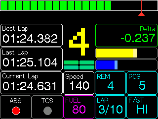 | 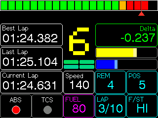 |
| 1 | **GT3**<br><sub>Tema scuro motorsport (predefinito), contagiri ad arco</sub> | 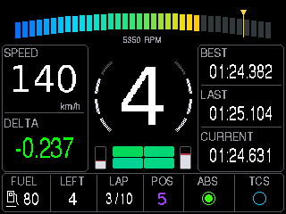 | 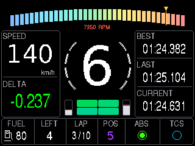 |
| 2 | **Retro**<br><sub>Strumentazione carta e inchiostro</sub> | 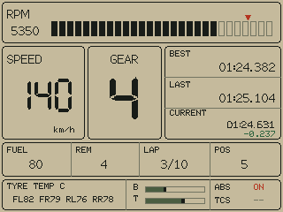 | 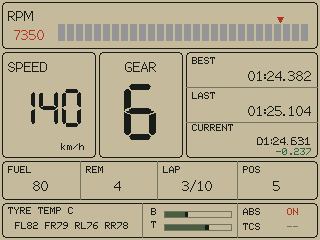 |
| 3 | **Radar**<br><sub>Contagiri circolare al centro</sub> | 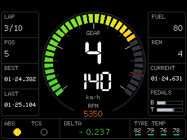 | 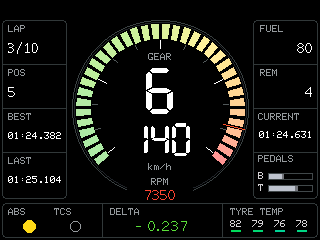 |
| 4 | **Mono**<br><sub>Digitale monocromatico</sub> | 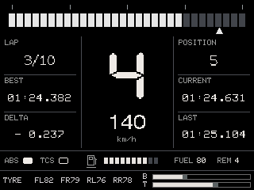 | 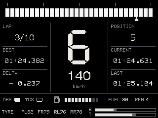 |
| 5 | **Pocket**<br><sub>LCD da console portatile a 4 toni</sub> | 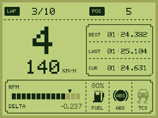 | 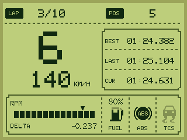 |
| 6 | **Endurance**<br><sub>Gare di durata: gomme, carburante, giri</sub> | 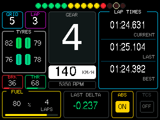 | 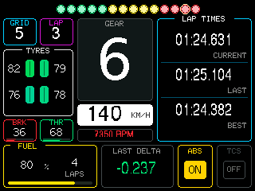 |
| 7 | **Ferrari**<br><sub>Marcia su pannello giallo, 16 LED, freno/gas, turbo e benzina</sub> | 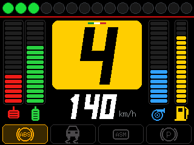 | 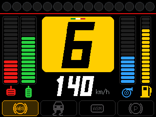 |
| 8 | **Ferrari AC**<br><sub>Per Assetto Corsa: frizione, avanzamento giro, spia PIT</sub> | 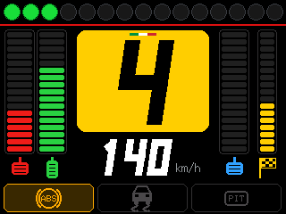 | 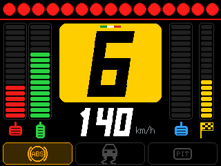 |
| 9 | **Ferrari Gold**<br><sub>Come Ferrari, con riquadro della marcia consigliata</sub> | 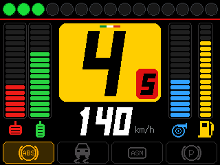 | 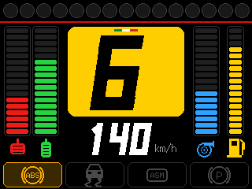 |
| 10 | **BMW M**<br><sub>Pannello blu, orologio, marcia consigliata</sub> | 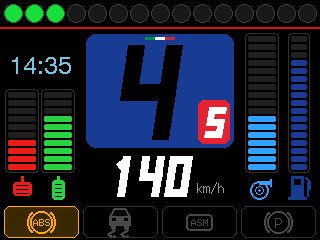 | 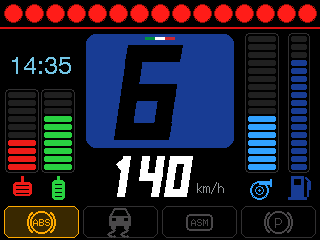 |

<sub>I temi 7–10 sono stati aggiunti in questo progetto; i temi 0–6 vengono da <a href="https://github.com/caa1211/esp32-gt7-dashboard">esp32-gt7-dashboard</a>.</sub>

## Schermata di attesa

Compare quando il gioco non trasmette. In alto, lo stato del Wi-Fi e della striscia LED (pallino verde se trovata, tocca "LED" per aprirne i controlli). In basso, l'indirizzo IP dello schermo.

| Minimale | Racing |
| :-: | :-: |
| 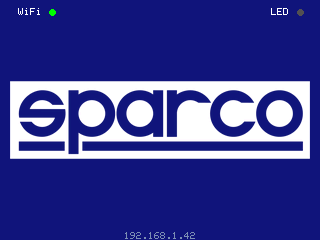 | 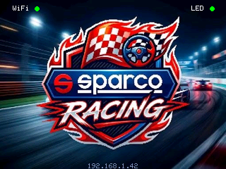 |

## Menu e impostazioni

Tocca lo schermo in qualsiasi momento per aprire il menu. Senza tocchi si chiude da solo dopo 15 secondi.

| Impostazioni | Selezione tema | Sfondo di attesa |
| :-: | :-: | :-: |
| 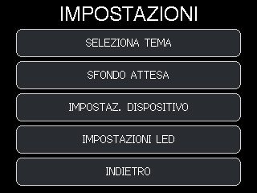 | 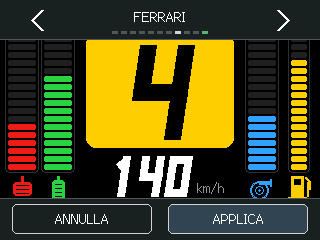 | 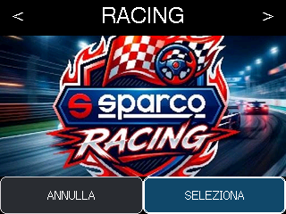 |
| **Controllo LED** | **LED non trovata** | **Dispositivo** |
| 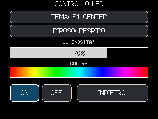 | 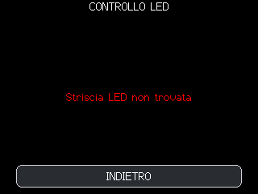 | 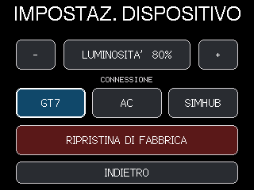 |
| **Scelta connessione** | **Configurazione Wi-Fi** | **Ripristino totale** |
| 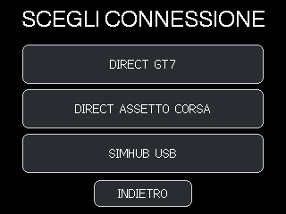 | 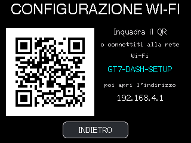 | 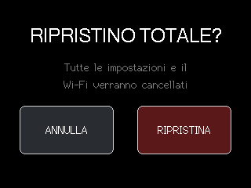 |
| **Calibrazione touch** | | |
| 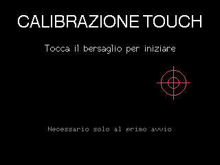 | | |

| Schermata | Cosa fa |
| --- | --- |
| **Impostazioni** | Accesso a tema, sfondo di attesa, dispositivo e LED |
| **Selezione tema** | Anteprima dal vivo, frecce per scorrere gli 11 temi, *Applica* per salvarlo |
| **Sfondo attesa** | Sceglie tra *Minimale* (logo Sparco su blu) e *Racing* (sfondo a tutto schermo) |
| **Controllo LED** | Tema e animazione di riposo, slider di luminosità e colore (si trascina col dito), ON/OFF |
| **Dispositivo** | Luminosità dello schermo, sorgente dati (GT7, AC, SimHub), ripristino di fabbrica |
| **Scelta connessione** | Al primo avvio: GT7 diretto, Assetto Corsa diretto o SimHub USB |
| **Configurazione Wi-Fi** | QR code per collegarsi alla rete `GT7-DASH-SETUP` e aprire `192.168.4.1` |
| **Calibrazione touch** | Solo al primo avvio, per orientare correttamente il touch |

---

## Striscia LED

### Temi

| # | Tema | Effetto |
| :-: | --- | --- |
| 0 | **Default** | Si riempie da sinistra: verde fino al 60%, giallo fino all'85%, poi rosso |
| 5 | **Default Reverse** | Come Default, da destra a sinistra |
| 1 | **F1 Center** | Dal centro verso i bordi, simmetrico, verde/giallo/rosso |
| 4 | **F1 Reverse** | Dai bordi verso il centro |
| 2 | **Supercar** | Si accende solo sopra il 70% dei giri, tutta blu |
| 3 | **Smooth Fade** | Tutta la striscia sfuma da azzurro ghiaccio a rosso |

Con il **limitatore** attivo (flag di GT7) tutti i temi lampeggiano in rosso. Il **gorgoglio** fa tremolare gli ultimi LED accesi, con intensità regolabile (0 = spento).

### Animazioni a gioco fermo

| Modo | Effetto |
| --- | --- |
| Spento | Nessuna luce |
| Colore fisso | Colore scelto, a luminosità piena |
| Respiro | Il colore scelto pulsa lentamente |
| Arcobaleno | Arcobaleno che scorre |

### Pagina web

All'indirizzo IP della striscia (mostrato sul monitor seriale) c'è la pagina di configurazione con telemetria in tempo reale. Al primo avvio la striscia crea la rete Wi-Fi **`GT7_LED_Config`** per inserire la password di casa.

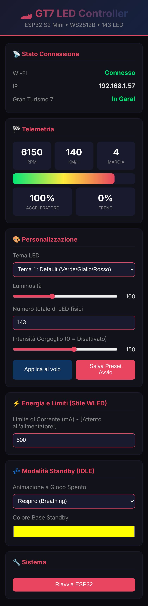

---

## Comunicazione tra schermo e LED

| Direzione | Canale | Contenuto |
| --- | --- | --- |
| LED → rete | UDP broadcast, porta **33741**, ogni 2 s | `GT7LED\|<ip della striscia>` |
| Schermo → LED | `GET http://<ip>/api/status` | Stato JSON: `rpm`, `gear`, `brightness`, `theme`, `idleMode`, `gurgle`, `leds`, `maxMa`, `idleColor`, … |
| Schermo → LED | `GET http://<ip>/api/settings?b=&l=&g=&ma=&im=&ic=&save=1` | Luminosità, numero LED, gorgoglio, limite mA, animazione di riposo, colore |
| Schermo → LED | `GET http://<ip>/api/theme?v=<0-5>` | Tema LED |
| Browser → LED | `GET http://<ip>/restart` | Riavvio |

Gli indici di tema (0–5) e di animazione di riposo (0–3) sono gli stessi nei due firmware: `enum Theme` e `enum IdleMode` in [`firmware/led-strip/src/main.cpp`](firmware/led-strip/src/main.cpp).

---

## Compilare e caricare i firmware

Serve **[PlatformIO](https://platformio.org/)**: l'estensione per VS Code oppure `pip install platformio`. Le librerie e il compilatore ESP32 si scaricano da soli alla prima compilazione (la vecchia cartella `core` non va copiata).

**Schermo**

```bash
cd firmware/dashboard
pio run -e esp32-2432s024c -t upload     # ESP32-2432S024C (touch capacitivo)
# pio run -e esp32 -t upload             # ESP32-2432S028 ILI9341
# pio run -e esp32-st7789 -t upload      # ESP32-2432S028 ST7789
pio device monitor
```

**Striscia LED**

```bash
cd firmware/led-strip
pio run -t upload
pio device monitor
```

La porta COM viene trovata in automatico. Se non la trova, togli il `;` davanti a `upload_port` in `platformio.ini` e scrivi la tua porta (per esempio `COM9` per lo schermo, `COM8` per i LED).

> GitHub Actions compila entrambi i firmware a ogni push. I file `.bin` pronti si scaricano dagli *Artifacts* della scheda **Actions**.

**Primo avvio dello schermo:** calibrazione touch → scelta connessione → configurazione Wi-Fi tramite QR. Poi avvia GT7 sulla stessa rete: lo schermo trova la PS5 da solo.

---

## Struttura del repository

```
├── firmware/
│   ├── dashboard/                 Schermo 320×240 (PlatformIO, ESP32)
│   │   ├── platformio.ini         3 ambienti: 2432S024C, 2432S028, 2432S028-ST7789
│   │   ├── src/
│   │   │   ├── main.cpp           Avvio, rete, sorgenti di telemetria
│   │   │   ├── SHCustomProtocol.h Logica del cruscotto, menu, controllo LED
│   │   │   ├── dashboard/themes/  Gli 11 temi (*.inc)
│   │   │   ├── board/             Configurazione display e touch della scheda
│   │   │   ├── ACUdpTelemetry.h   Telemetria Assetto Corsa
│   │   │   └── sparco_*.h         Immagini della schermata di attesa
│   │   ├── lib/                   GT7 UDP, metriche derivate, librerie SimHub
│   │   ├── simhub/                Formula Custom Protocol per SimHub
│   │   ├── docs/                  Protocollo di telemetria, sviluppo temi, EV
│   │   └── tests/                 Test del protocollo SimHub
│   └── led-strip/                 Striscia LED WS2812B (PlatformIO, ESP32-S2)
│       ├── platformio.ini
│       └── src/main.cpp           Temi LED, pagina web, API, discovery
├── docs/
│   ├── screenshots/               Tutte le schermate 320×240 (generate)
│   ├── SIMHUB.md                  Guida SimHub USB
│   └── img/
├── tools/
│   ├── screenshots/               Simulatore su PC che genera gli screenshot
│   ├── images/image_to_header.py  Converte un'immagine in header RGB565 per lo schermo
│   └── serial_log.py              Riavvia la scheda e salva il log seriale
└── .github/workflows/build.yml    Compilazione automatica e test
```

## Rigenerare gli screenshot

Gli screenshot si ottengono compilando sul PC il vero codice di disegno del firmware (`SHCustomProtocol.h` e i temi) insieme a LovyanGFX 1.1.12. Il display è simulato con una sprite in memoria, che poi viene salvata come PNG 320×240. Su Linux o WSL:

```bash
tools/screenshots/build.sh                 # tutte le schermate in docs/screenshots/
python3 tools/screenshots/mosaic.py        # immagine di apertura del README
node tools/screenshots/led-web.mjs         # pagina web LED (richiede Playwright)
```

Per aggiungere una schermata, aggiungi uno scenario in [`tools/screenshots/render.cpp`](tools/screenshots/render.cpp).

## Crediti e licenze

- Cruscotto basato su **[caa1211/esp32-gt7-dashboard](https://github.com/caa1211/esp32-gt7-dashboard)** (temi 0–6, protocollo SimHub, rete) e sull'ecosistema **ESP-SimHub**.
- Decodifica GT7 con **[MacManley/gt7-udp](https://github.com/MacManley/gt7-udp)** (MIT), copia condivisa dai due firmware in `firmware/dashboard/lib/GT7Udp`.
- Grafica con **[LovyanGFX](https://github.com/lovyan03/LovyanGFX)**, LED con **[FastLED](https://github.com/FastLED/FastLED)**, Wi-Fi con **[WiFiManager](https://github.com/tzapu/WiFiManager)**.
- *Gran Turismo* è un marchio di Sony Interactive Entertainment. *Ferrari*, *BMW M*, *Sparco* e *Assetto Corsa* appartengono ai rispettivi proprietari: qui sono usati solo come ispirazione grafica per un progetto personale, senza alcuna affiliazione.
