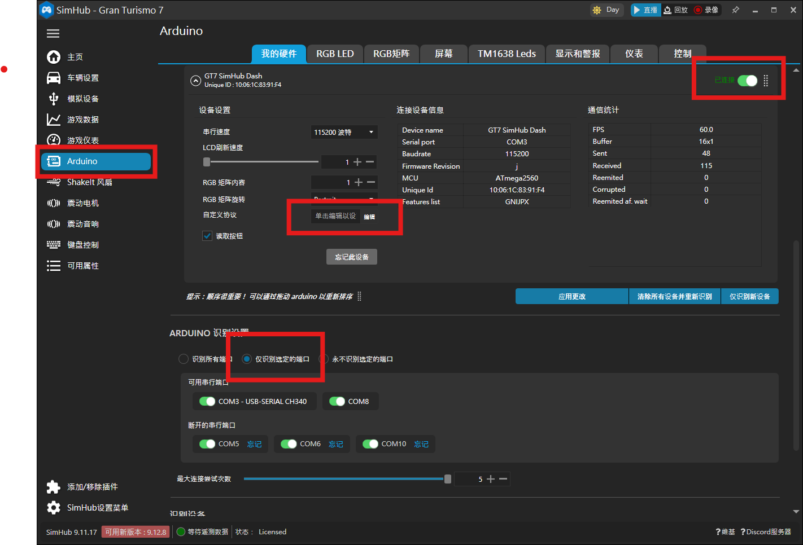

# SimHub USB setup

The dashboard supports **Direct GT7** over Wi-Fi and **SimHub USB** for PC games. SimHub USB does not require Wi-Fi. All dashboard themes use the same Custom Protocol formula.

## 1. Prepare the dashboard

1. Connect the dashboard to the PC with a data-capable USB cable.
2. Select **SIMHUB USB** on the dashboard. From a Waiting screen, use **SWITCH TO SIMHUB USB** at the top; from Settings, open **Device Settings** and select **SIMHUB USB**.
3. Close Arduino Serial Monitor, PlatformIO Serial Monitor, and any other application using the same COM port.

## 2. Let SimHub detect the dashboard

1. Open SimHub and go to **Arduino**.
2. Open the **Multiple Arduino** or **Multiple USB** devices page. The label varies slightly between SimHub versions; use this page even when only one dashboard is connected.

*Open Arduino, then select Multiple Arduino so SimHub can scan the dashboard.*

3. Enable Arduino support so SimHub scans the USB devices.
4. Find the dashboard's COM port, then add or enable that device. Its firmware identification is `GT7 SimHub Dash`.
5. Wait for SimHub to show the device as connected. Detecting the COM port only confirms the USB connection; telemetry requires the Custom Protocol in the next section.

*Confirm that SimHub identifies `GT7 SimHub Dash`, enables the correct COM port, and shows the device as connected.*

The initial connection uses 19200 baud and SimHub negotiates the later rate automatically. No virtual COM port, TCP bridge, or extra plugin is required.

## 3. Add the Custom Protocol

1. Open **Custom Protocol** or its formula editor for the Arduino device you just added.
2. Enable **Use JavaScript**.

*Choose **Use JavaScript** when SimHub asks how to bind the protocol message.*

3. Open [simhub/custom-protocol.txt](../firmware/dashboard/simhub/custom-protocol.txt), copy its **entire contents**, and paste them into the formula field.

*Open the repository protocol file, copy all of it, paste it into the JavaScript field, then select **OK**.*

4. Select Apply or Save and verify that the protocol is enabled for the correct COM device.
5. Do not append `\n`; SimHub adds the line ending automatically.

The formula editor's **Raw result** should begin with `DSH1;` and its second field should keep increasing, for example `DSH1;391;...`. This confirms that the formula is running. It does not by itself confirm that the correct COM device is receiving the data.

This uses SimHub's **Arduino Custom Protocol**, not the Custom Serial Devices plugin. Do not use SimHub's generic Arduino sketch upload because it would overwrite the dashboard firmware.

## 4. Start the game

1. Start or select a supported PC game in SimHub.
2. Confirm that SimHub is receiving game data.
3. The dashboard changes from **Waiting for SimHub** to the selected theme.

If SimHub detects the device but the dashboard remains on Waiting:

- **USB linked: set Custom Protocol**: USB and SimHub are linked, but no valid formula data has arrived. Enable **Use JavaScript**, paste the complete formula, and select Apply or Save.
- **Check Custom Protocol (DSH1)**: the formula has the wrong format or version. Paste [simhub/custom-protocol.txt](../firmware/dashboard/simhub/custom-protocol.txt) again.
- **Waiting for SimHub** remains: verify the data cable, selected COM port, serial-port ownership, and that SimHub is receiving live game data.
- Raw result starts with `DSH1;` and its sequence increases, but Waiting remains: confirm Custom Protocol is enabled for the same Arduino device and COM port shown as connected in SimHub.
- Individual values show `--`: the current game may not expose those properties; other supported values still work.
- Fuel never changes: check the game's fuel-consumption setting and SimHub's `Fuel`, `FuelPercent`, and capacity properties. For example, 30 litres in a 64-litre tank correctly displays 47%; unlimited fuel will keep that value unchanged.
- The firmware filters a brief neutral value during a gear change for 750 ms. A sustained or initial neutral still displays `N`.

## Notes

- All seven themes use the same formula. Changing themes does not require another SimHub setup.
- The current connection choice is saved. Switch directly from the Waiting screen, or select **DIRECT GT7** / **SIMHUB USB** in **Device Settings**.
- **Reset to Default** clears Wi-Fi and all dashboard preferences, then restarts first-time setup.
- Historical formulas elsewhere in the repository use an older packet format. For this firmware, use only [simhub/custom-protocol.txt](../firmware/dashboard/simhub/custom-protocol.txt).

## References

- [SimHub Custom Arduino Hardware Support](https://github.com/SHWotever/SimHub/wiki/Custom-Arduino-hardware-support)
- [SimHub JavaScript Formula Engine](https://github.com/SHWotever/SimHub/wiki/Javascript-Formula-Engine)
- [Telemetry protocol and validation](../firmware/dashboard/docs/TELEMETRY_PROTOCOL.md)
